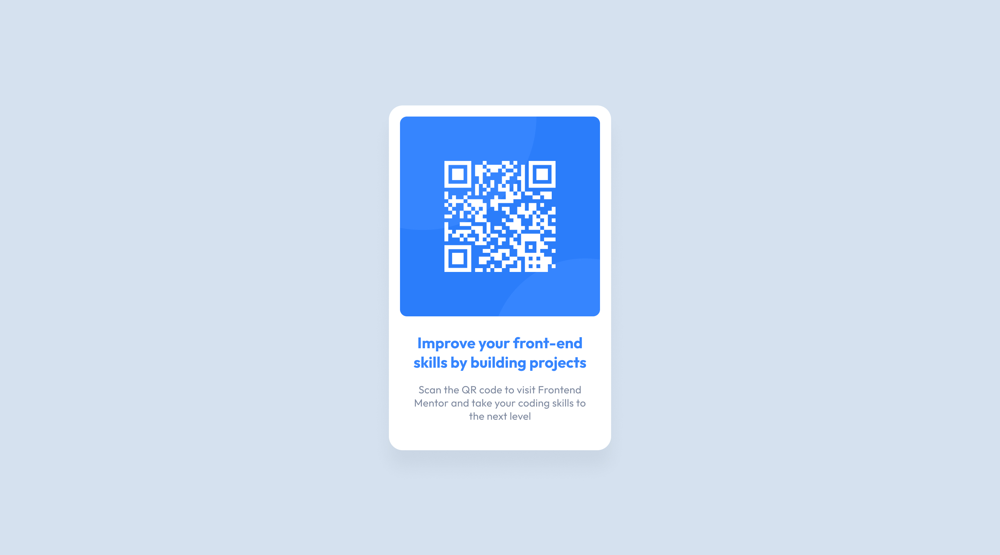

<h1 align="center"> LinkTree </h1>

Desafio desenvolvido por <a href="https://www.frontendmentor.io">frontendmentor.io</a>

  <a href="#-tecnologias">Tecnologias</a>&nbsp;&nbsp;&nbsp;|&nbsp;&nbsp;&nbsp;
  <a href="#-projeto">Projeto</a>&nbsp;&nbsp;&nbsp;|&nbsp;&nbsp;&nbsp;
  <a href="#-layout">Layout</a>&nbsp;&nbsp;&nbsp;|&nbsp;&nbsp;&nbsp;
  <a href="#memo-licença">Licença</a>

  

 

  

## 🚀 Tecnologias

Esse projeto foi desenvolvido com as seguintes tecnologias:

- HTML e CSS
- Git e Github
- Figma

## 💻 Projeto

O projeto linktree é um compilado de links úteis para servir como um cartão de visitas.

## 🔖 Layout

Você pode visualizar o layout do projeto através [DESSE LINK](https://www.figma.com/file/ZGr8LGt1loiqpCcU2TZcmc/qr-code-component?type=design&node-id=0-1468&mode=design&t=IlhC3wS5TRb8VAif-0). É necessário ter conta no [Figma](https://figma.com) para acessá-lo.

## :memo: Licença

Esse projeto está sob a licença MIT.

---

Feito com esforço por Rodrigo :wave:

# FEM-qrcode
